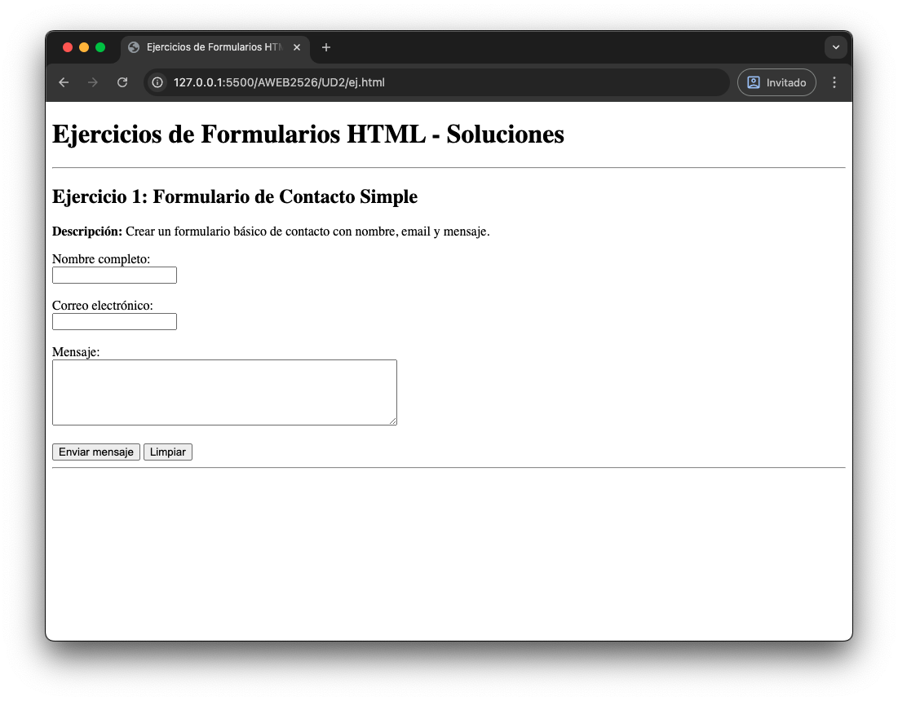
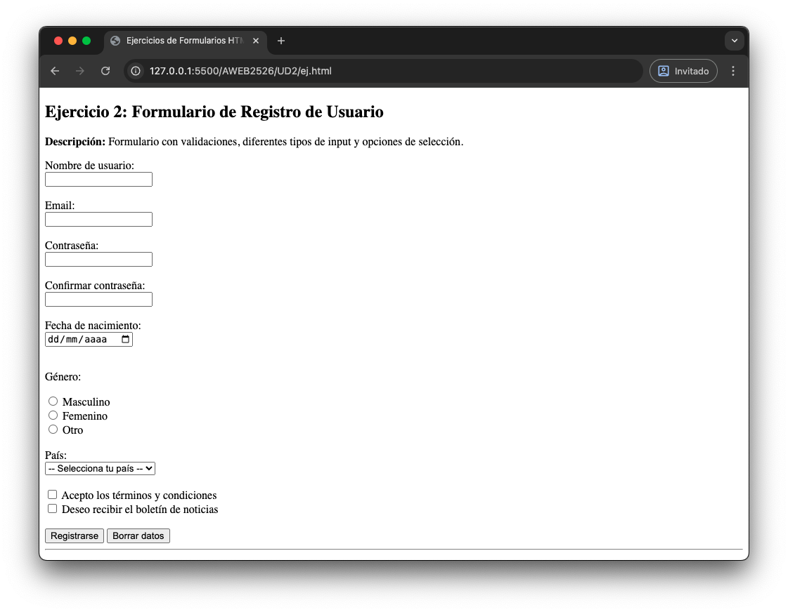
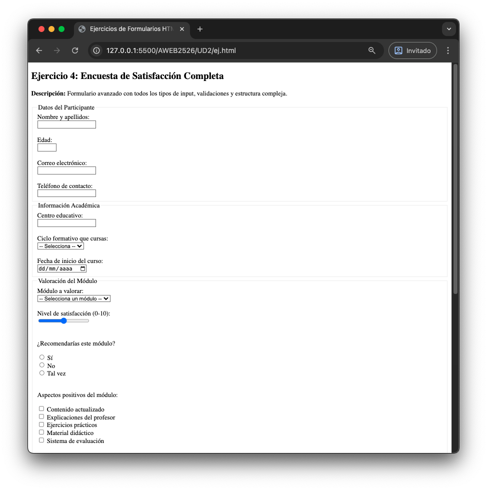
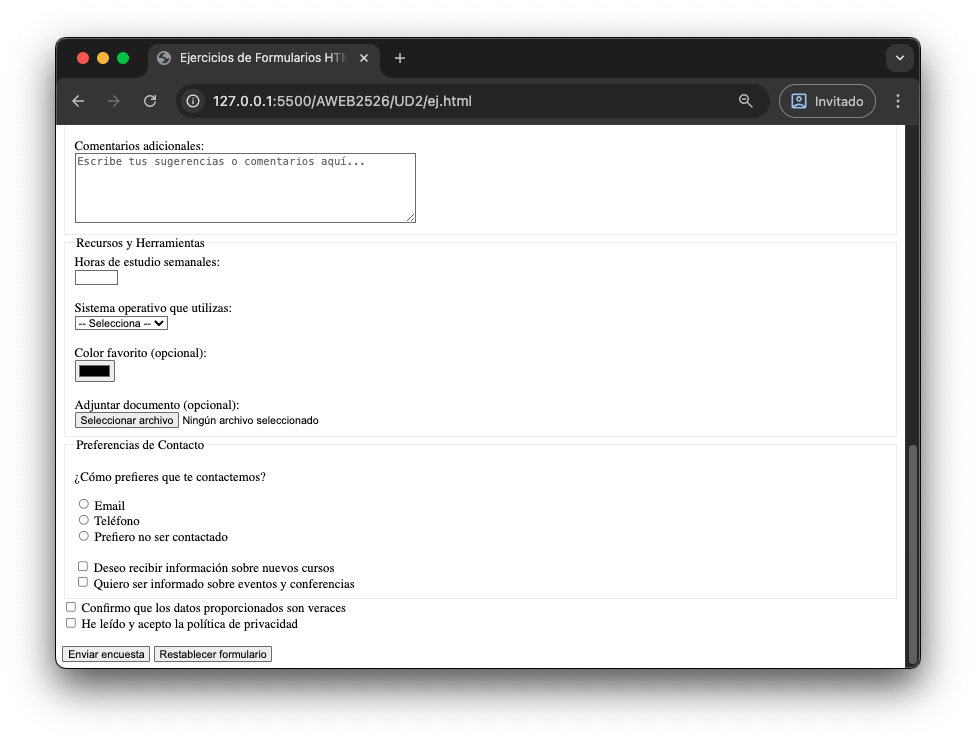

# Ejercicios de Formularios HTML

## Ejercicio 1: Crea en HTML el siguiente formulario

## Ejercicio 2: Crea en HTML el siguiente formulario

## Ejercicio 3: Crea en HTML el siguiente formulario

## Ejercicio 4: Crea en HTML el siguiente formulario

