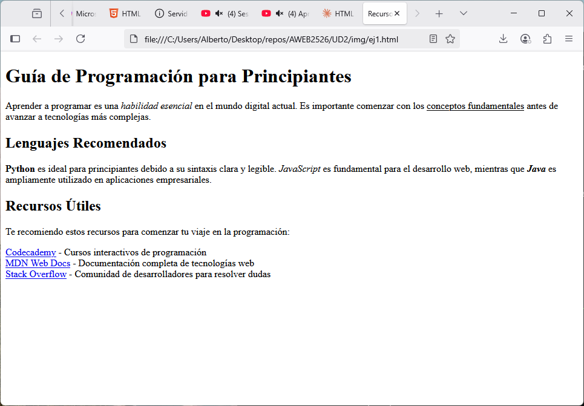
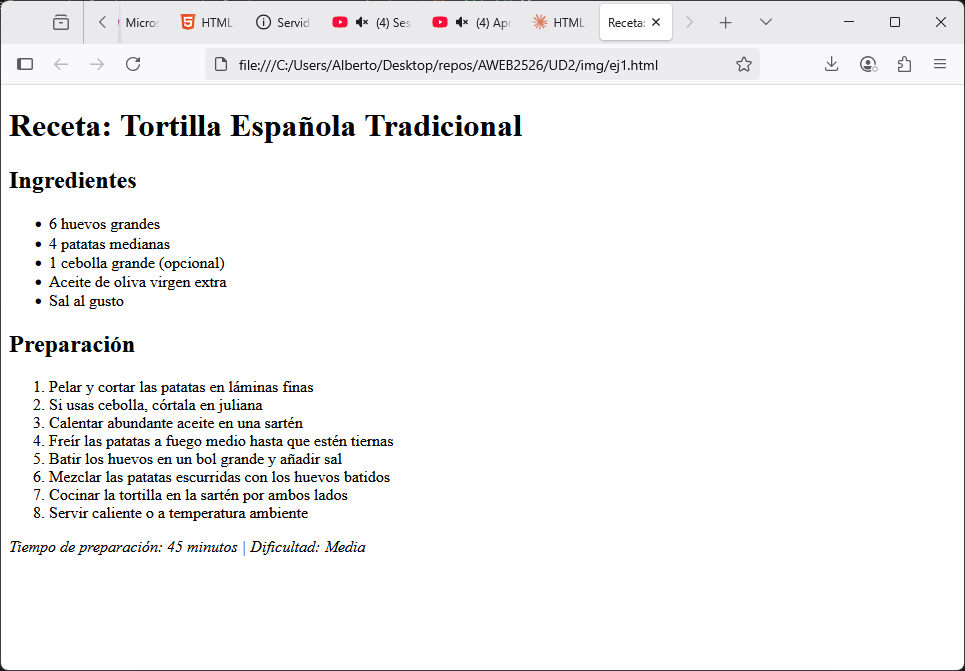
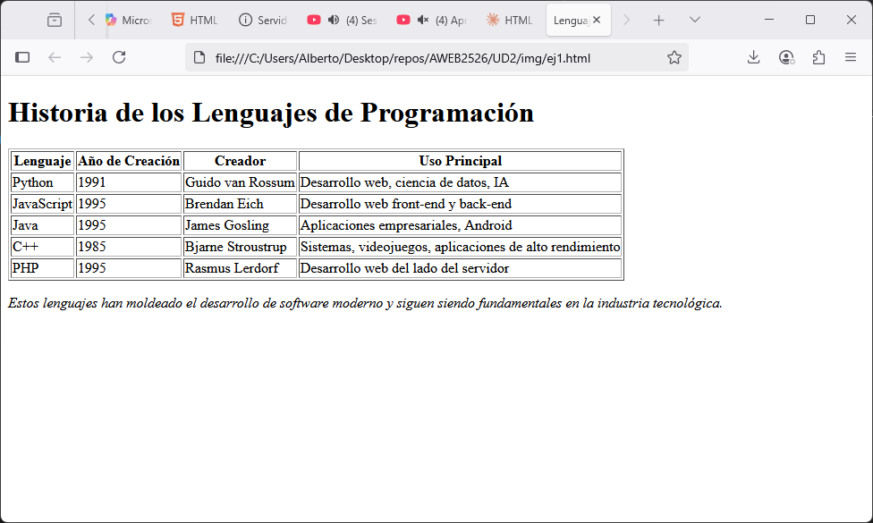
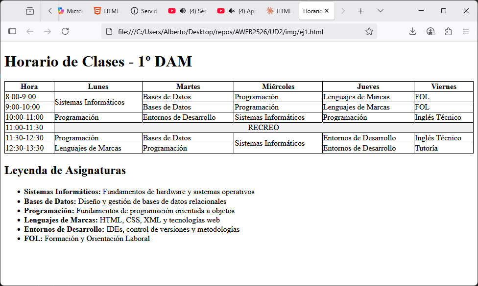
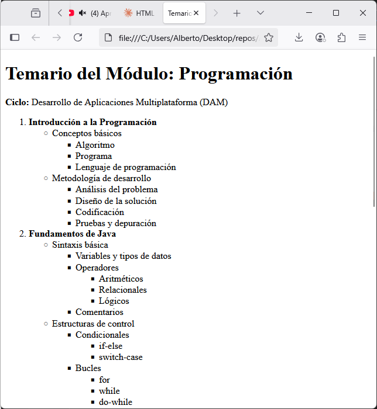
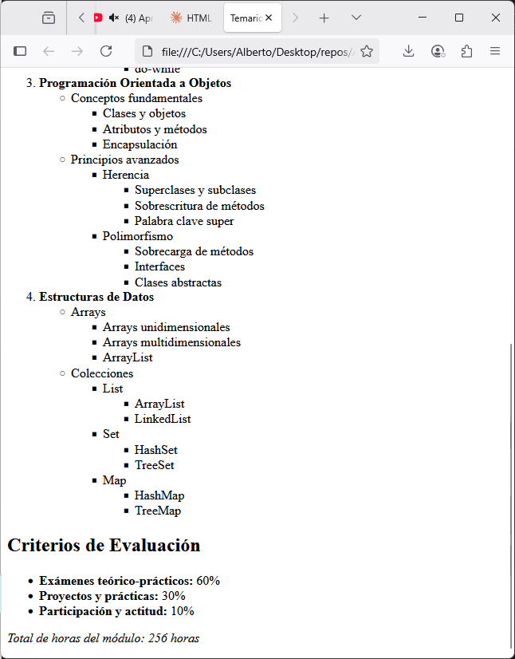

# Ejercicios de HTML

## Ejercicio 1: Crea en HTML el siguiente contenido

## Ejercicio 2: Crea en HTML el siguiente contenido

## Ejercicio 3: Crea en HTML el siguiente contenido

## Ejercicio 4: Crea en HTML el siguiente contenido

## Ejercicio 5: Crea en HTML el siguiente contenido

## Ejercicio 6: Crea en HTML el siguiente contenido

