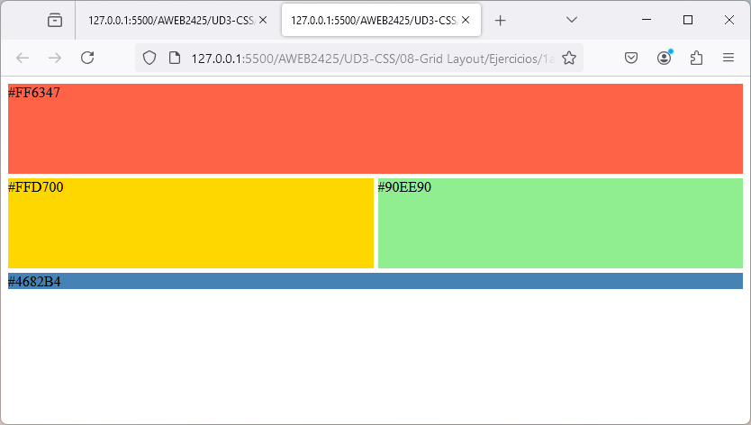
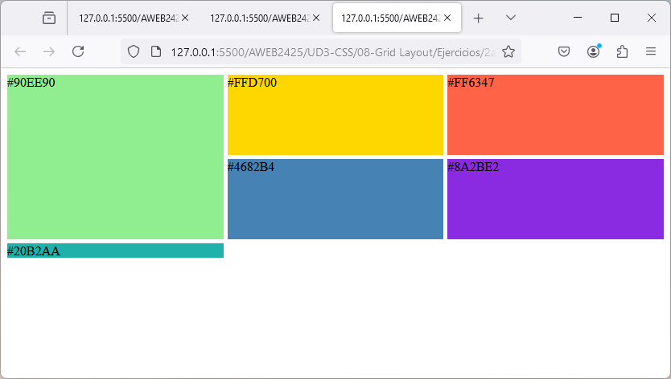
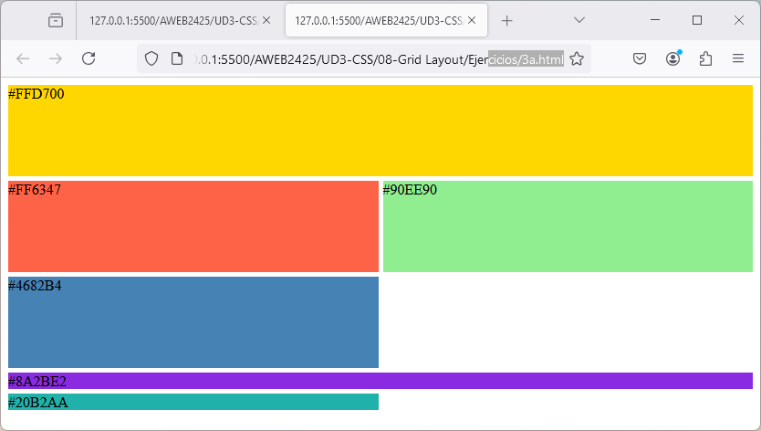
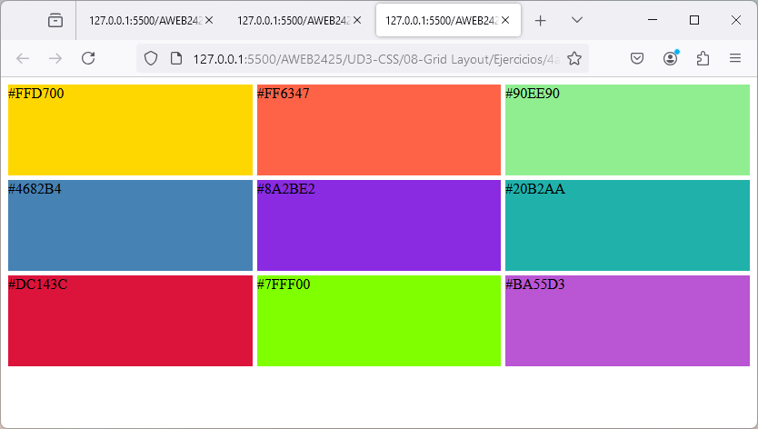
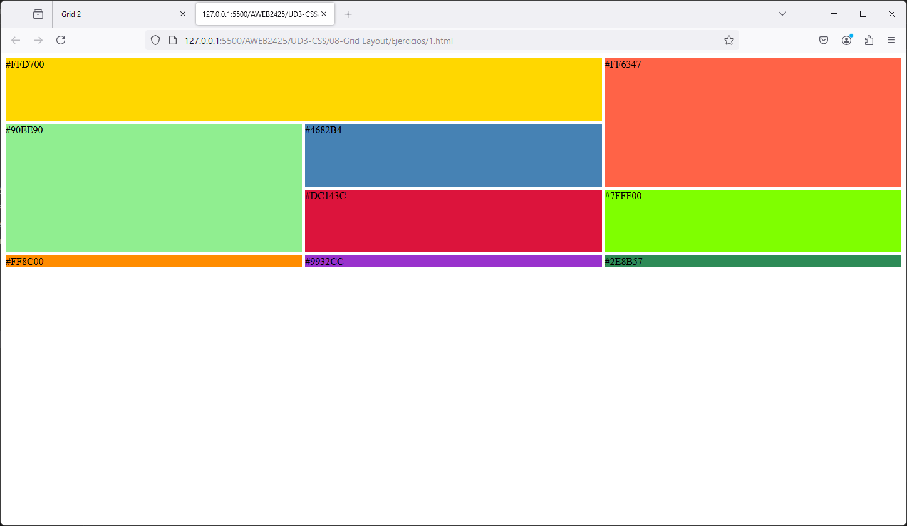
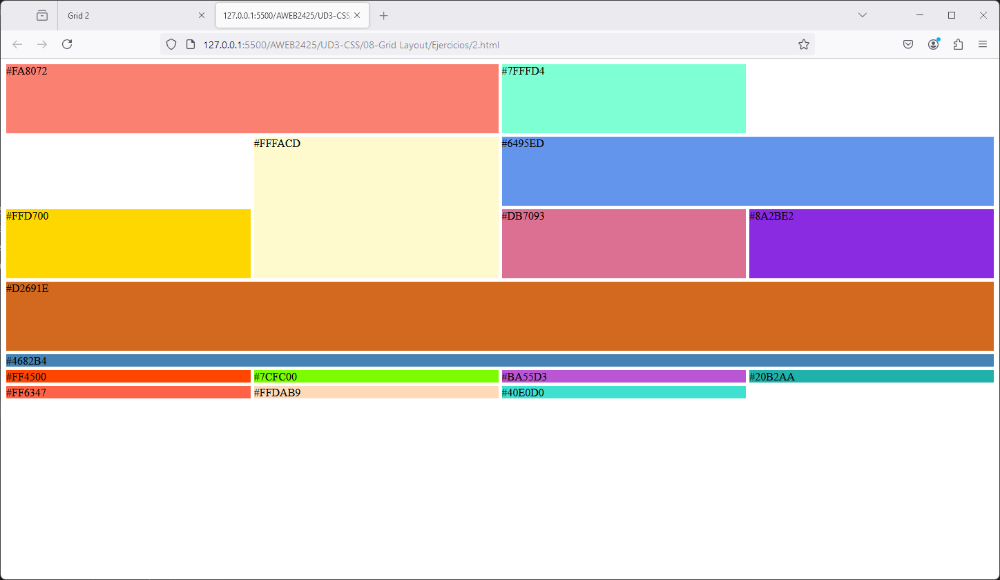
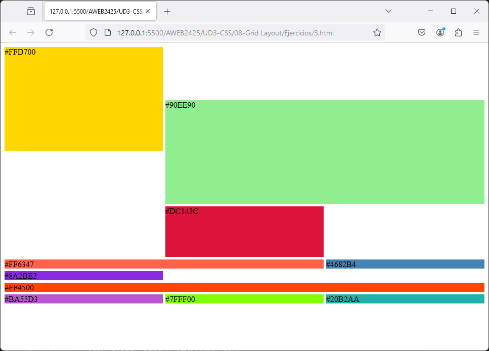
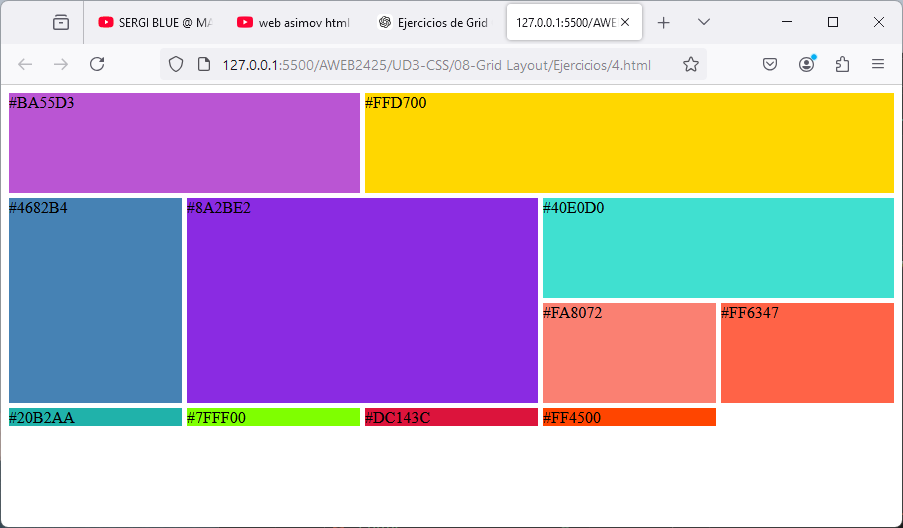

## Ejercicios Grid CSS

Para cada ejercicio debes crearte un archivo .html que contenga un contenido similar al mostrado en cada imagen. No es necesario que las cajas muestren el código de color (puedes enumerarlas mejor). El código de color sólo está para que lo uses a la hora de darle un fondo.

### Ejercicio 1

### Ejercicio 2

### Ejercicio 3

### Ejercicio 4

## Ejercicios Avanzados de CSS Grid

### Ejercicio 5

### Ejercicio 6

### Ejercicio 7

### Ejercicio 8

