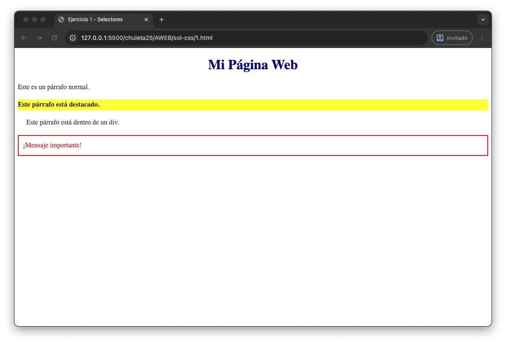
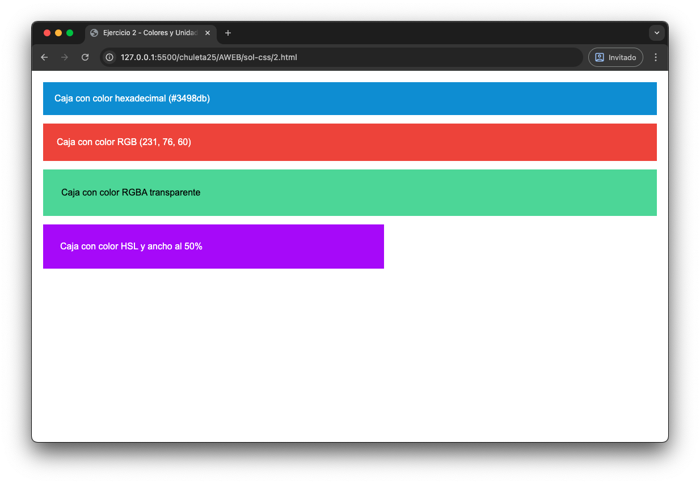
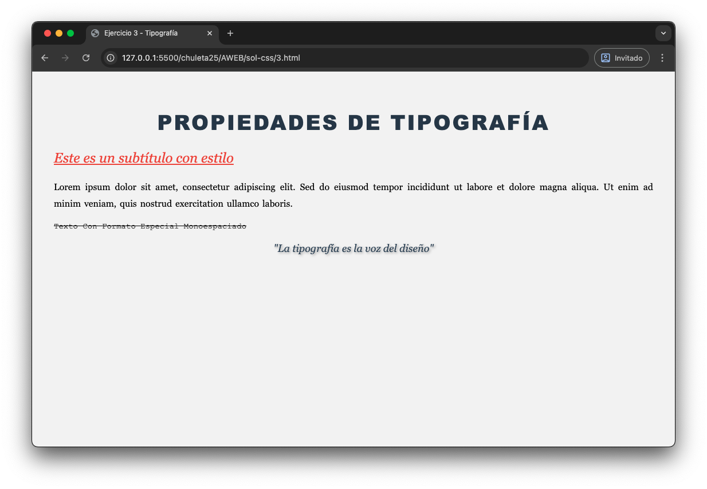
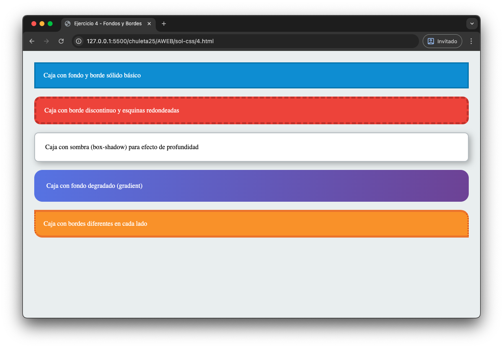
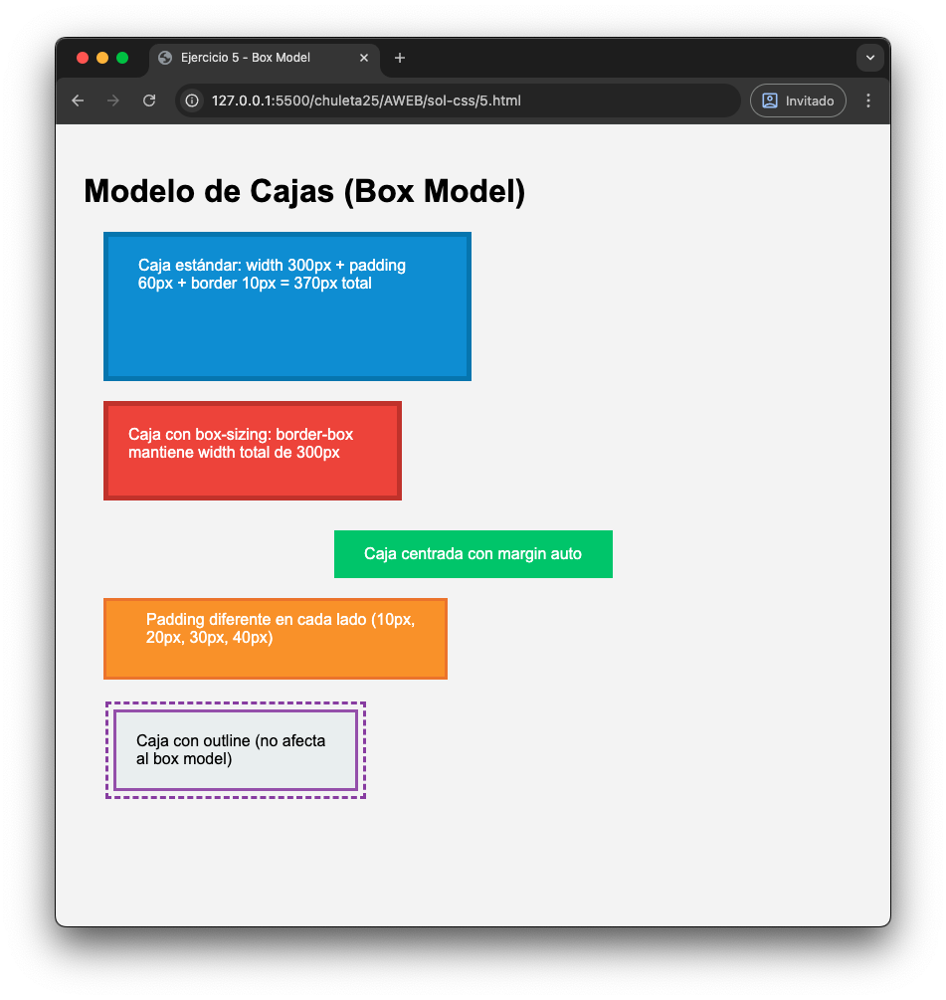

# Ejercicios CSS - parte 1

En esta carpeta encontraremos el codigo delos ejercicios de CSS que deberás copiarte en tu visual studio code para resolverlos. Están enlos archivos 1.html, 2html, 3.html 4.html y el 5.html Debes seguir los pasos indicados para obtener los siguientes resultados:

## Ejercicio 1

## Ejercicio 2

## Ejercicio 3

## Ejercicio 4

## Ejercicio 5

