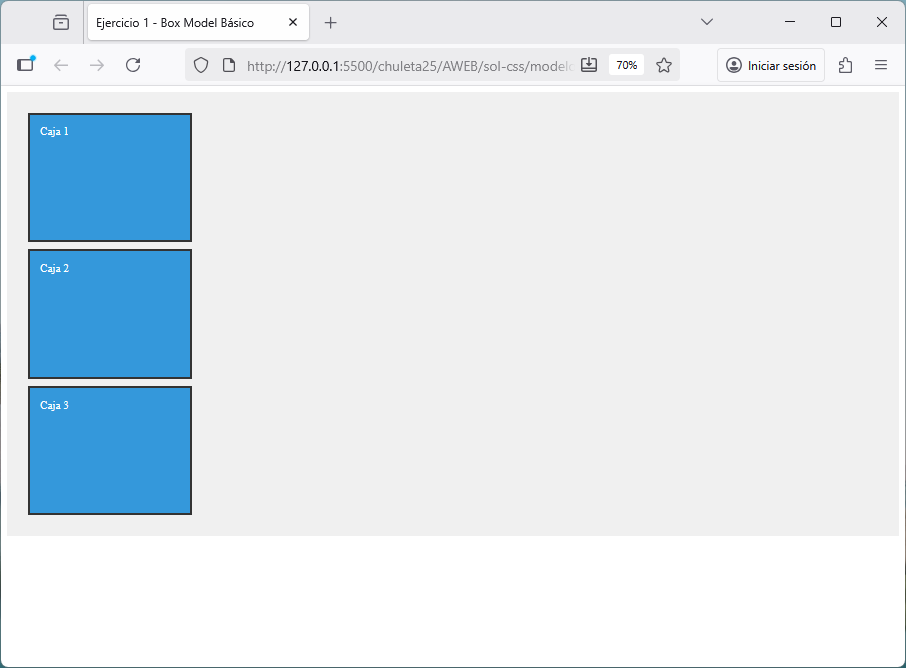
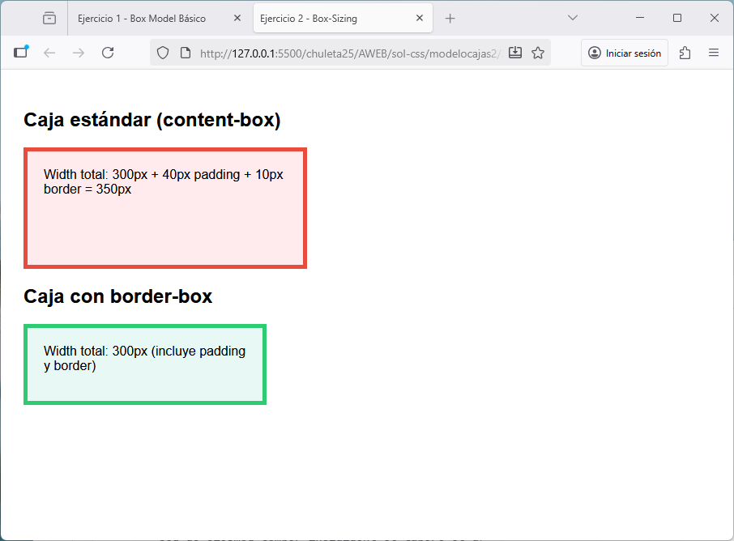
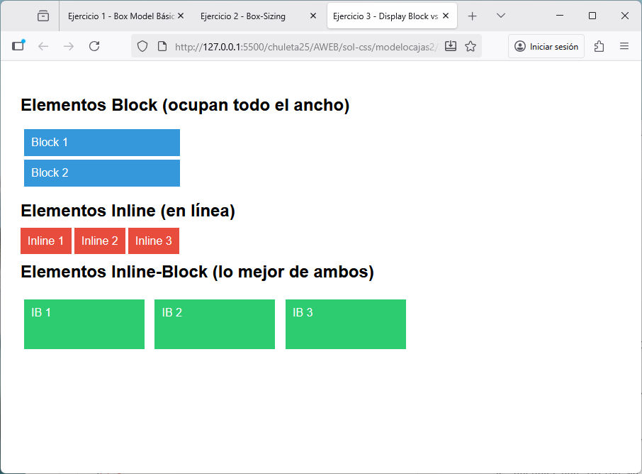
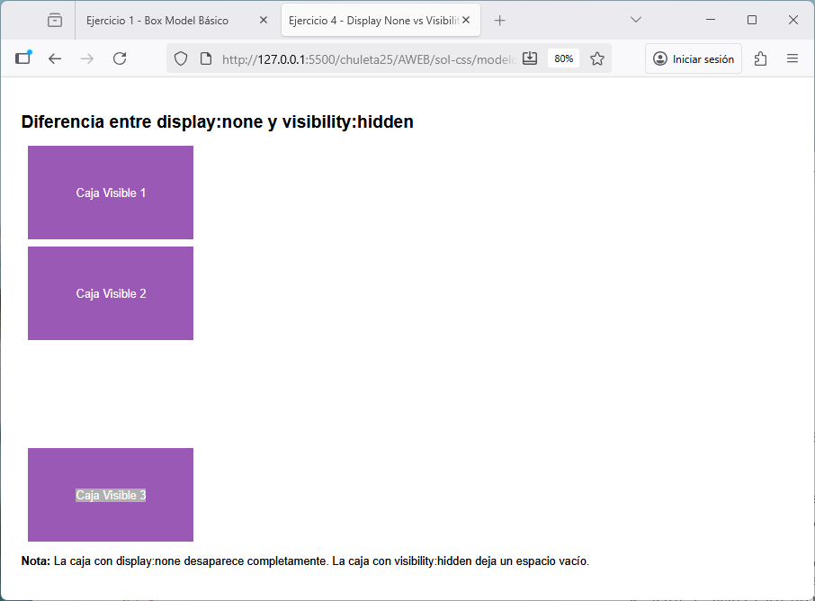
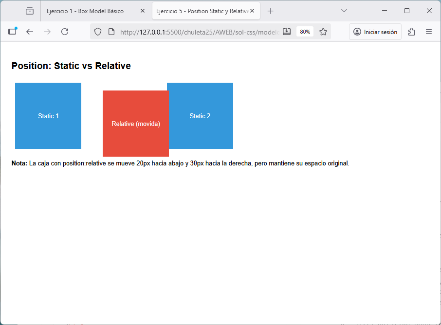
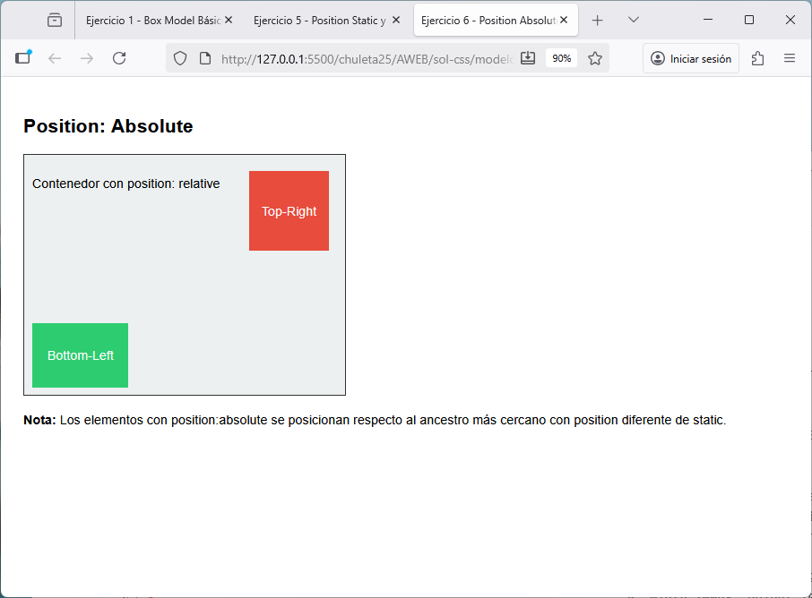
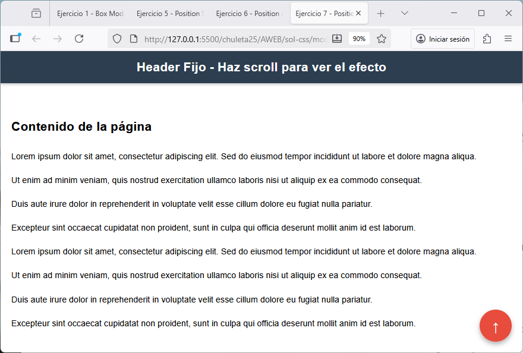
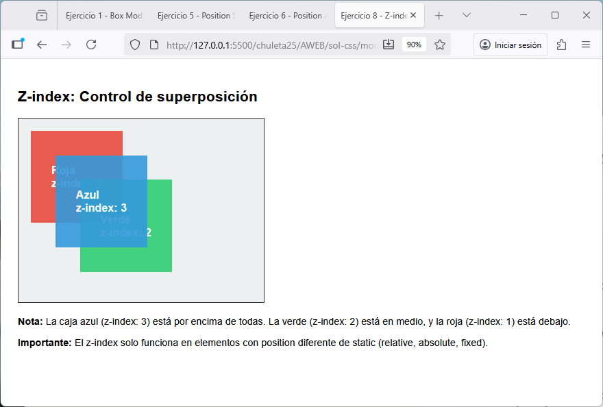
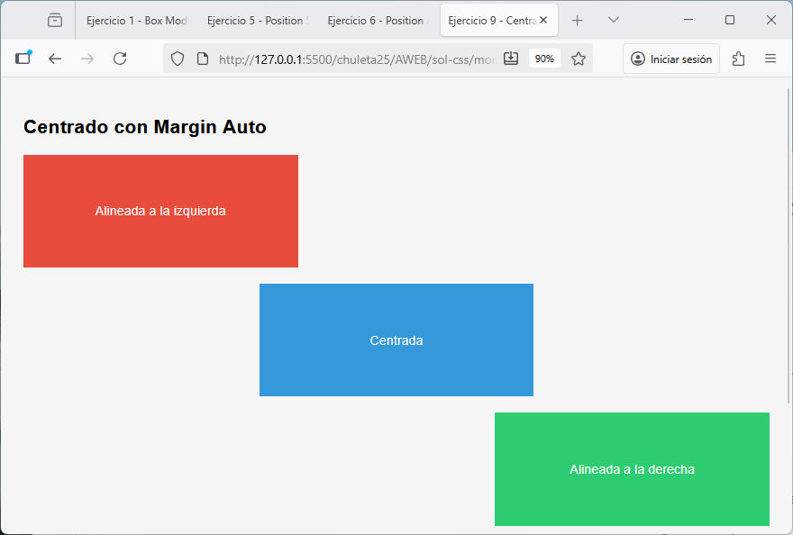
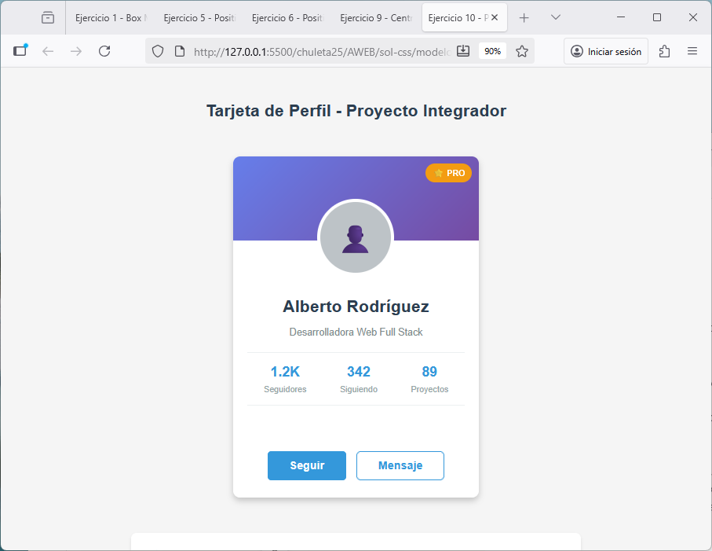

# Ejercicios CSS - Modelo de Cajas, Display y Posicionamiento

En esta carpeta encontrarás 10 ejercicios de CSS que cubren los conceptos fundamentales de:
- **Modelo de cajas** (padding, margin, border, box-sizing)
- **Display** (block, inline, inline-block)
- **Posicionamiento** (static, relative, absolute, fixed)
- **Z-index** y capas

## 📋 Instrucciones

1. Abre cada archivo HTML en tu Visual Studio Code
2. Lee el enunciado detallado en los comentarios CSS
3. Completa el código CSS en la sección marcada como `/* TU CÓDIGO AQUÍ */`
4. Abre el archivo HTML en tu navegador para ver el resultado
5. Compara con las imágenes de referencia en la carpeta `soluciones/`

## 🎯 Ejercicios

### Ejercicio 1 - Modelo de Cajas Básico
Aprende a usar padding, margin, border y cómo calcular el tamaño total de una caja.

---

### Ejercicio 2 - Box-Sizing Border-Box
Comprende la diferencia entre `content-box` y `border-box`.

---

### Ejercicio 3 - Padding y Margin Individuales
Crea una tarjeta con espaciados personalizados usando propiedades individuales.

---

### Ejercicio 4 - Display: Block, Inline e Inline-Block
Experimenta con los diferentes valores de display y entiende sus diferencias.

---

### Ejercicio 5 - Centrar Elementos con Margin Auto
Domina técnicas de alineación horizontal usando `margin: auto`.

---

### Ejercicio 6 - Posicionamiento Static y Relative
Aprende la diferencia entre `position: static` y `position: relative`.

---

### Ejercicio 7 - Posicionamiento Absolute
Crea una tarjeta con elementos posicionados absolutamente dentro de un contenedor relativo.

---

### Ejercicio 8 - Posicionamiento Fixed
Crea elementos que permanecen fijos en la pantalla al hacer scroll (header, sidebar, botón flotante).

---

### Ejercicio 9 - Z-Index y Capas
Controla el orden de apilamiento de elementos usando `z-index`.

---

### Ejercicio 10 - Proyecto Integrador: Landing Page
Integra todos los conceptos aprendidos en una landing page completa.

---

## 💡 Consejos

- Lee los comentarios del enunciado con atención antes de empezar
- Prueba tu código frecuentemente en el navegador
- Usa las DevTools del navegador (F12) para inspeccionar elementos
- No modifiques los estilos marcados como `/* NO MODIFICAR */`
- Si te atascas, revisa los apuntes de clase sobre cada concepto

## 📚 Conceptos cubiertos

✅ Width y Height  
✅ Padding (individual y shorthand)  
✅ Margin (individual y shorthand, margin auto)  
✅ Border  
✅ Box-sizing: border-box  
✅ Display: block, inline, inline-block  
✅ Position: static, relative, absolute, fixed  
✅ Z-index  
✅ Top, right, bottom, left  

¡Buena suerte! 🚀